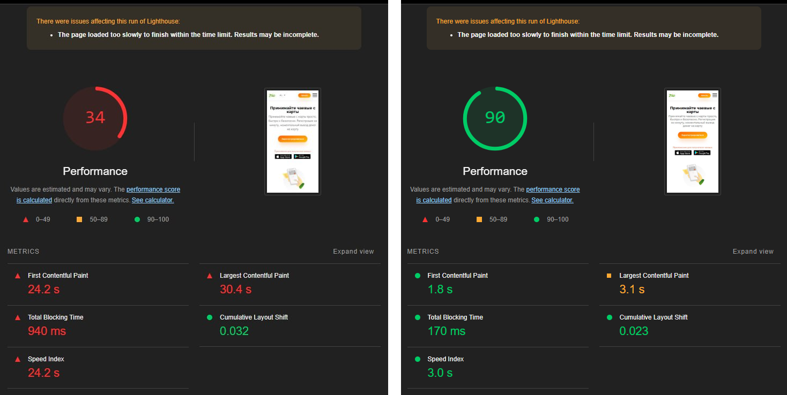
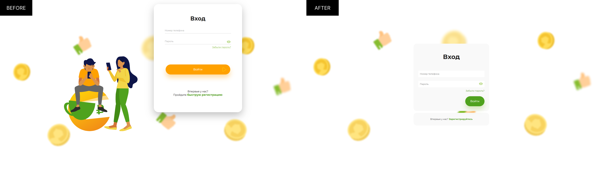
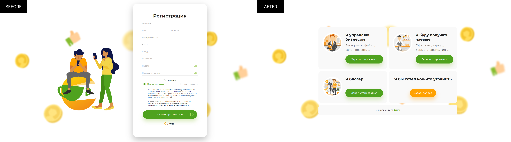
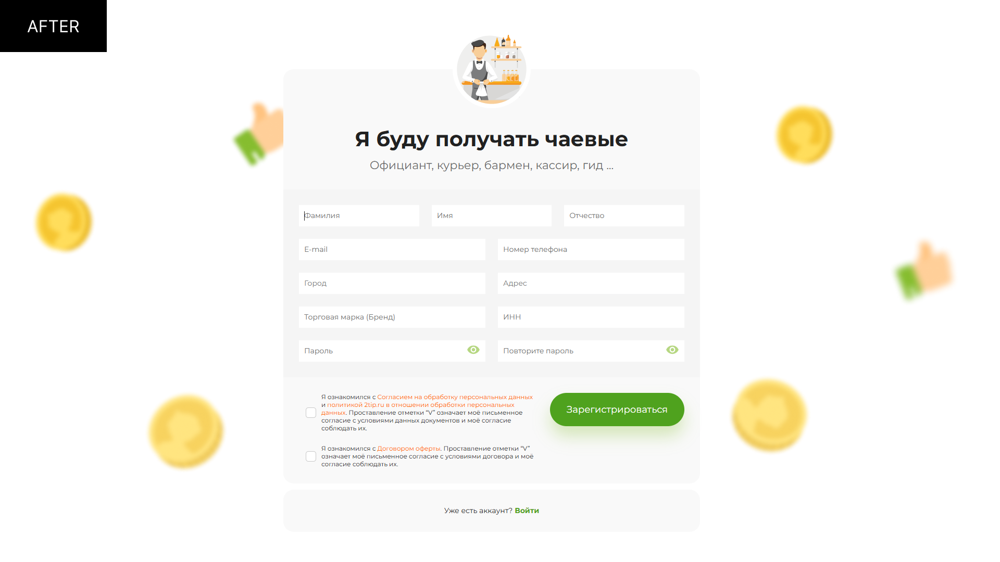
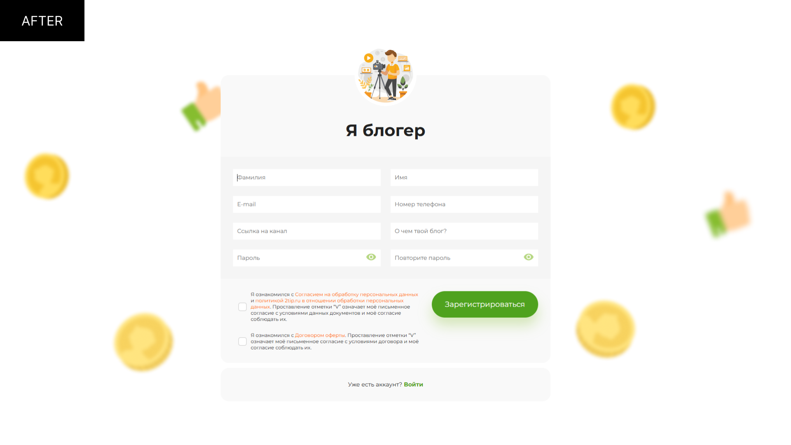

# 2tip

## Описание проекта

2tip - сервис для получения чаевых через QR-код, доступный для работников любых сфер. Позволяет клиентам оставлять электронные чаевые, оплачивая картой или через платежные системы, а работникам быстро выводить средства на карту.

## Моя роль в проекте

В рамках работы над текущей версией проекта я занимался оптимизацией производительности приложения, переработкой ключевых элементов интерфейса и внедрением новых функций для удобства пользователей.

- Оптимизировал производительность, увеличив показатель Google Lighthouse Performance с 34 до 90.
- Переработал форму регистрации, добавив новую роль и индивидуальные поля для каждой роли.
- Обновил интерфейсы авторизации, восстановления доступа и обратной связи.
- Внедрил автоматические подсказки для адресов с использованием DaData.
- Реализовал языковую локализацию интерфейса

## Технологии, используемые в проекте

    

## Принципы и инструменты разработки

- Код-стиль и форматирование: Prettier
- Система контроля версий: Gitlab
- Линтер: ESLint

## Команда

Общее количество человек: 6
Роли в команде:

- Frontend: 3
- Backend: 2
- Дизайнеры: 1

## Особые вызовы и преодоленные препятствия

Основной вызов при работе над проектом заключался в использовании устаревшей версии Next.js 10.1, которая имела значительные ограничения в производительности и гибкости разработки. Работа с этой версией требовала решения проблем, связанных с отсутствием современных возможностей, поддерживаемых в более новых версиях Next.js.

Для преодоления этих препятствий я переработал ключевые части приложения, оптимизировав производительность и устранив технические долги, чтобы улучшить взаимодействие пользователей с системой. Это включало улучшение скорости загрузки страниц, рефакторинг кода, адаптацию легаси-архитектуры и внесение изменений, направленных на поддержку новых функций.

## Галерея

## Ссылки

Сервис: [2tip.ru](https://2tip.ru/)

Код проекта находится под защитой соглашения о неразглашении NDA, из-за чего, к сожалению, не может быть предоставлен для общего доступа или просмотра.
