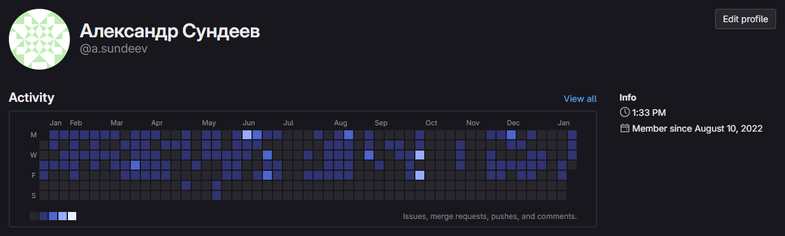

# Frontend разработчик

Привет, меня зовут Александр, я опытный Frontend-разработчик, специализирующийся на создании динамичных и отзывчивых пользовательских интерфейсов

## Опыт и навыки

Работаю в области коммерческой разработки более 4 лет.

Моя специализация включает в себя создание различных видов сайтов и приложений, в том числе платежных систем, социальных сетей, информационно-познавательных и развлекательных ресурсов, а также других интересных проектов.

**Фреймворки и библиотеки**

  

**Языки и препроцессоры**

 
  

**Сетевые технологии**

   

**Состояние и управление**

   

**Сборка и инфраструктура**

 

**Тестирование**

## Вклад в проекты компаний

### [Freematiq](https://freematiq.com/)

В процессе работы я активно вносил свой вклад в проекты, что отражено в моих коммитах на внутреннем сервере GitLab. К сожалению, я не могу предоставить прямые ссылки на эти репозитории из-за ограничений доступа и политики безопасности. Однако ниже представлен скриншот моей активности в разных проектах:

Скриншот показывает мою постоянную активность и участие в разработке, а также подтверждают мой опыт и профессиональный вклад.

#### Проекты

Несколько коммерческих проектов которые демонстрируют мои профессиональные навыки:

- [Zakroma-presentation](./zakroma-presentation/README.md)
- [2tip (текущий)](./2tip/README.md)
- [2tip (новый)](./2tip/README.md)
- [CoshKey 2.0](./CoshKey2.0/README.md)

Мой вклад в организацию работы компании:

Разработал **Frontend Starter System** — систему для быстрой и модульной разработки интерфейсов.

Эта система включает в себя мощную архитектуру, адаптированную как для верстки (WordPress, Bitrix), так и для интеграции с современными фреймворками (React, Next.js, Vue.js). Она была спроектирована для оптимизации процесса разработки, повышения производительности и упрощения поддержки кода.

Сегодня она применяется в реальных проектах.

[Frontend Starter System](./fss/README.md)

## О себе

Увлечен веб-технологиями, особенно фронтендом. Постоянно изучаю нативный JavaScript и современные фреймворки, чтобы находить и внедрять оптимальные решения. Умею работать как самостоятельно, так и в команде, эффективно решая задачи, создавая производительные и адаптивные интерфейсы.

Стремлюсь к развитию и открыт к новым задачам.

**В настоящее время** нахожусь в активном поиске работы и готов взяться за интересные и вызывающие проекты, которые позволят мне применять и развивать свои навыки в создании пользовательских интерфейсов.

---

## Связаться со мной:

E-mail: [sw700x@gmail.com](mailto:sw700x@gmail.com)

Telegram: [@sw700x](https://t.me/sw700x)
