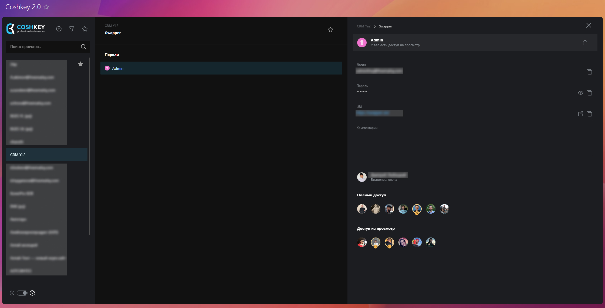
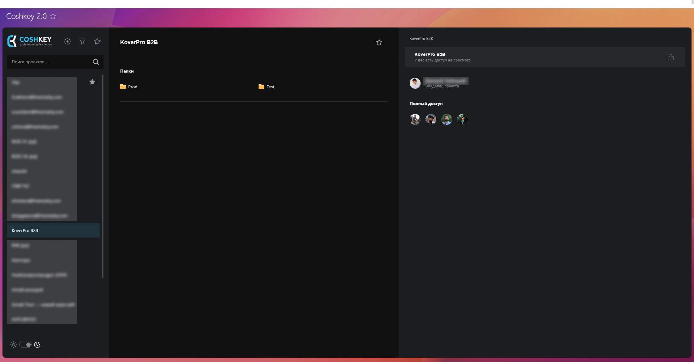

# CoshKey 2.0

## Описание проекта

CoshKey 2.0 - это обновленный сервис для безопасного хранения и управления паролями внутри компаний. Он позволяет создавать и редактировать пароли и папки, управлять правами доступа, версионировать пароли, генерировать сложные пароли, а также шифровать их с помощью индивидуальных ключей пользователей. В сервисе есть журнал обновлений, настройки безопасности и возможность установки на собственный сервер. Логи изменений, доступов и авторизаций также отслеживаются, обеспечивая безопасность данных и доступ только для нужных сотрудников.

## Моя роль в проекте

Я занимался разработкой клиентской части приложения, внедрением новых функций для управления паролями и папками. Также устранял критические ошибки и оптимизировал работу интерфейса для повышения производительности.

- **Расширил функционал избранного:** Добавил возможность добавления и удаления проектов, папок и ключей в "Избранное" для быстрого доступа к важным данным.
- **Реализовал фильтры и поиск:** Внедрил фильтрацию и поиск по проектам, что значительно упростило работу с большим объемом информации.
- **Доработка интерфейса:** Улучшил элементы интерфейса, добавив адаптацию для мобильных устройств, оптимизацию визуальных элементов, а также внедрил поддержку динамической темизации (светлая/тёмная тема).

## Технологии, используемые в проекте

     

## Код (Предпросмотр)

В данном разделе представлены отрывки кода, демонстрирующие ключевые моменты и методы, использованные в проекте. Эти фрагменты кода отражают стиль программирования, архитектурные решения и технологические практики, применённые в ходе работы.

<details>
<summary><strong>Компонент избранного</strong> (Нажмите, чтобы раскрыть)</summary>

```
<template>
  <snackbar v-if="error && clicked === item.id" v-model="isErrorSnackbarShown" :message="error.text" type="error" />
  <snackbar
    v-model="isSuccessSnackbarShown"
    :message="isFavorite ? 'Добавлено в избранное' : 'Удалено из избранного'"
    type="success"
  />
  <v-list-item
    color="primary"
    :class="$attrs.class"
    :active="isActive"
    :to="props.to"
    @mouseover="hovered = item.id"
    @mouseleave="hovered = null"
  >
    <template #prepend>
      <slot name="prepend" />
    </template>
    <slot name="default" />
    <template v-if="permanentButton || isFavorite || hovered === item.id" #append>
      <v-btn
        :icon="isFavorite ? IconStarFilled : IconStar"
        :loading="isLoading && clicked === item.id"
        class="my-btn"
        color="grey"
        size="small"
        variant="text"
        @click.stop.prevent="toggle"
      />
    </template>
  </v-list-item>
</template>

<script lang="ts" setup>
import { ref, computed, onMounted, watch } from 'vue';
import { RouteLocationRaw } from 'vue-router';

import { useProjectStore } from '@/store/project';
import { useFolderStore } from '@/store/folder';
import { usePasswordStore } from '@/store/password';

import { TFavoritableEntity, EntityType } from '@/models/common';

import Snackbar from '@/components/common/Snackbar.vue';
import { IconStar, IconStarFilled } from '@tabler/icons-vue';

const props = defineProps<{
  to?: RouteLocationRaw;
  type: EntityType;
  item: TFavoritableEntity;
  isActive?: boolean;
  permanentButton?: boolean;
}>();

const stores = {
  [EntityType.Project]: useProjectStore(),
  [EntityType.Folder]: useFolderStore(),
  [EntityType.Password]: usePasswordStore(),
};

const hovered = ref<number | string | null>(null);
const clicked = ref<number | string | null>(null);
const current = ref(props.item);
const isErrorSnackbarShown = ref(true);
const isSuccessSnackbarShown = ref(false);

const isFavorite = computed(() => current.value.favorite);

const isLoading = computed(() => stores[props.type]?.scope.favorite.isLoading ?? false);
const error = computed(() => stores[props.type]?.scope.favorite.error);
const isDone = computed(() => stores[props.type]?.scope.favorite.data);

const toggle = () => {
  clicked.value = current.value.id;
  stores[props.type].toggleFavorite(current.value);
};

watch(isDone, () => {
  isSuccessSnackbarShown.value = false;
  if (!isDone.value || error.value || clicked.value !== current.value.id) {
    return;
  }
  isSuccessSnackbarShown.value = true;
  clicked.value = null;
  current.value.favorite = !current.value.favorite;
});

watch(
  () => props.item,
  (newItem) => {
    current.value = newItem;
  },
);

onMounted(() => {
  stores[props.type].scope.favorite.error = null;
});
</script>
```

</details>

<details>
<summary><strong>Компонент поиска с фильтрами</strong> (Нажмите, чтобы раскрыть)</summary>

```
<template>
  <form data-test="form" @submit.prevent="submit" @reset.prevent="reset">
    <v-card class="w-100 mx-auto fill-height" rounded="0" color="transparent" flat>
      <v-toolbar flat color="transparent" class="px-5" height="90">
        <v-text-field
          v-model="query.q"
          :append-inner-icon="IconSearch"
          :placeholder="`Введите ${SEARCH_MIN_LENGTH_TEXT}`"
          density="compact"
          variant="solo"
          rounded="pill"
          data-test="q"
          autofocus
          hide-details
          flat
          :bg-color="appStore.isCompactLayout ? 'background' : 'surface'"
          @keyup.enter="submit"
        />
      </v-toolbar>
      <v-card-text class="pt-0" :class="appStore.isLaptopLayout ? 'px-5' : 'px-9'">
        <div class="text-subtitle-2 text-medium-emphasis mb-1">Владелец</div>
        <v-autocomplete
          v-model="selectedUser"
          bg-color="surface"
          density="compact"
          variant="outlined"
          item-title="name"
          item-value="id"
          data-test="owner"
          clearable
          return-object
          :clear-icon="IconSquareRoundedX"
          :menu-icon="IconSelector"
          :items="users"
          :menu-props="users.length > 0 ? { maxWidth: '400px' } : {}"
          :loading="userStore.scope.list.isLoading"
          :no-data-text="userStore.scope.list.isLoading ? 'Поиск...' : 'Нет результатов'"
          :placeholder="`Введите ${SEARCH_MIN_LENGTH_TEXT}`"
          :no-filter="true"
          @update:search="searchUser"
        />
        <div class="text-subtitle-2 text-medium-emphasis mb-1">Цвет</div>
        <color-selector v-model="query.color" data-test="color" show-reset-button />
      </v-card-text>
      <v-card-actions class="pt-5" :class="appStore.isLaptopLayout ? 'px-5' : 'px-9'">
        <v-btn
          class="mr-4"
          :class="appStore.isLaptopLayout ? 'px-6' : 'px-8'"
          color="primary"
          variant="flat"
          size="large"
          type="submit"
          :disabled="!isSearchStringValid"
        >
          Искать
        </v-btn>
        <v-btn
          :class="appStore.isLaptopLayout ? 'px-6' : 'px-8'"
          color="secondary"
          variant="outlined"
          size="large"
          type="reset"
          >Сбросить</v-btn
        >
      </v-card-actions>
    </v-card>
  </form>
</template>

<script lang="ts" setup>
import debounce from 'lodash/debounce';
import { ref, computed, watch } from 'vue';
import { useRoute, useRouter } from 'vue-router';
import { useProjectStore } from '@/store/project';
import { useUserStore } from '@/store/user';
import { useAppStore } from '@/store/app';

import { TProjectItem } from '@/models/project';
import { TUser } from '@/models/user';

import ColorSelector from '@/components/common/ColorSelector.vue';
import { ExtendedEntityType, ExtendedTSearchQuery } from '@/models/common';
import { RouteNames } from '@/router';
import { IconSearch } from '@tabler/icons-vue';
import { SEARCH_MIN_LENGTH, SEARCH_MIN_LENGTH_TEXT } from '@/constants/validationConst';

import { IconSquareRoundedX, IconSelector } from '@tabler/icons-vue';

const route = useRoute();
const router = useRouter();
const projectStore = useProjectStore();
const userStore = useUserStore();
const appStore = useAppStore();

const projects = computed<TProjectItem[]>(() => {
  const items = projectStore.scope.list.data ?? [];
  if (selectedUser.value) {
    return items.filter((item) => item.user_id === selectedUser.value?.id);
  }
  return items;
});

const users = computed<TUser[]>(() => {
  const items = userStore.scope.list.data ?? [];
  const project = projects.value.find((item) => query.value.project && +item.id === +query.value.project);
  if (project) {
    return items.filter((item) => item.id === project.user_id);
  }
  return items;
});

const isSearchStringValid = computed(() => query.value.q.length >= SEARCH_MIN_LENGTH);

const selectedUser = ref<TUser | null>(null);

const query = ref<ExtendedTSearchQuery>({
  type: (route.query.type as ExtendedEntityType) ?? ExtendedEntityType.All,
  project: (route.query.project as string) ?? '',
  owner: (route.query.owner as string) ?? '',
  color: (route.query.color as string) ?? '',
  q: (route.query.q as string) ?? '',
});

const submit = () => {
  if (!isSearchStringValid.value) {
    return;
  }
  if (route.name === RouteNames.Search) {
    router.replace({ name: RouteNames.Search, query: query.value, force: true });
  } else {
    router.push({ name: RouteNames.Search, query: query.value });
  }
};

const reset = () => {
  selectedUser.value = null;
  query.value = {
    type: ExtendedEntityType.All,
    project: '',
    owner: '',
    color: '',
    q: '',
  };
};

const searchUser = debounce((query: string) => {
  if (query.length >= SEARCH_MIN_LENGTH) {
    userStore.search(query);
  }
}, 500);

watch(selectedUser, (user) => {
  query.value.owner = user?.id ? user.id.toString() : '';
});
</script>

```

</details>

## Принципы и инструменты разработки

- Код-стиль и форматирование: Prettier
- Система контроля версий: Gitlab
- Линтер: ESLint

## Команда

Общее количество человек: 7
Роли в команде:

- Frontend: 2
- Backend: 2
- Дизайнеры: 1
- Тестирование: 2

## Галерея





---

## Ссылки

Код проекта находится под защитой соглашения о неразглашении NDA, из-за чего, к сожалению, не может быть предоставлен для общего доступа или просмотра.
