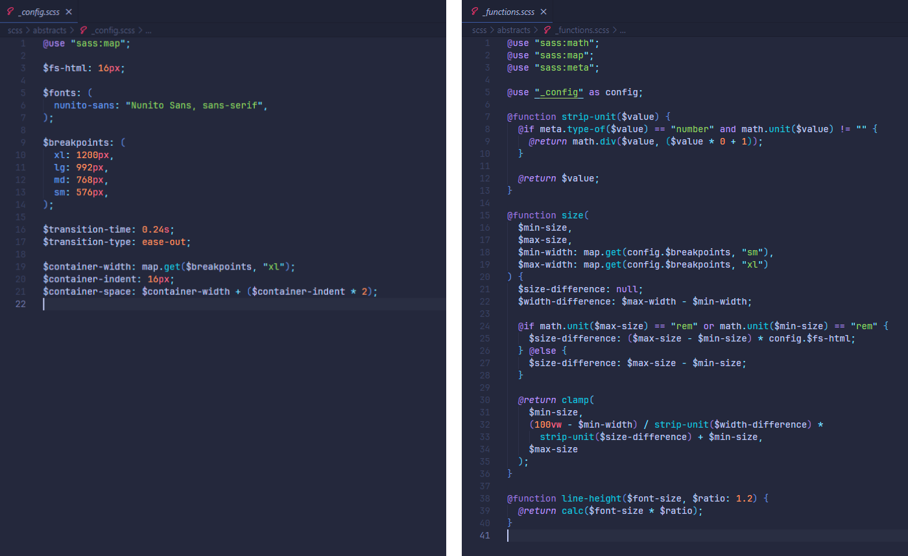
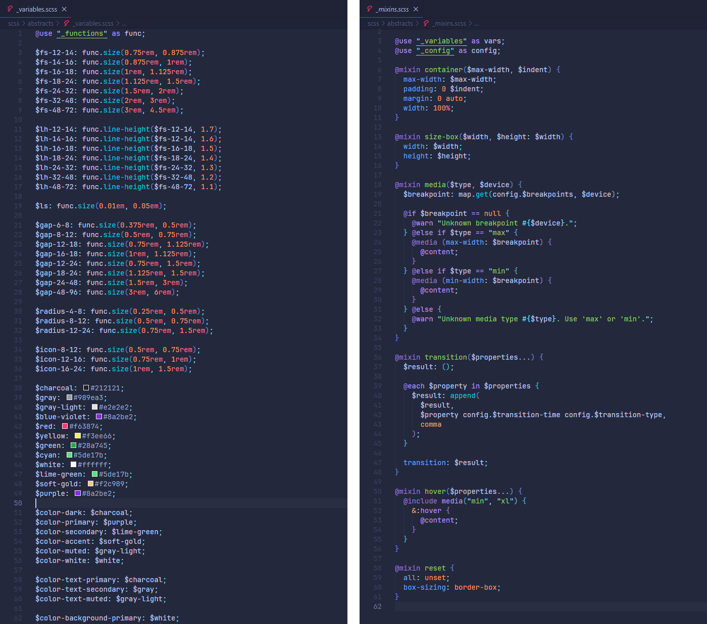
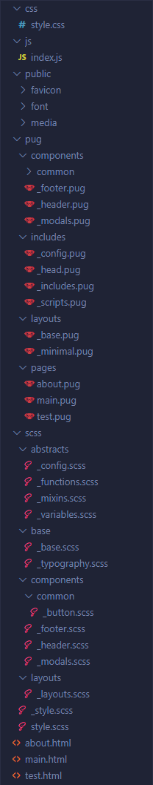
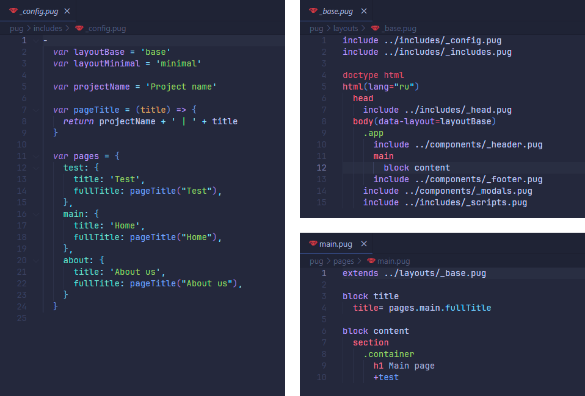
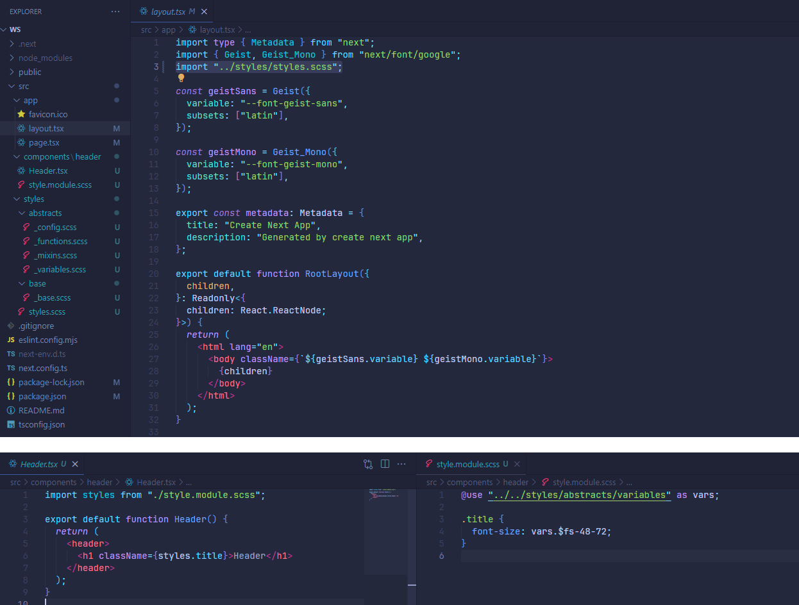

# Frontend Starter System

## Описание проекта

**Frontend Starter System** – это модульная система разработки интерфейсов, созданная с соблюдением принципов **DRY (Don't Repeat Yourself)** и **KISS (Keep It Simple, Stupid)**. Она предотвращает дублирование кода, упрощает разработку и поддержку проекта. Система предназначена для быстрого создания интерфейсов как для статической вёрстки, так и для интеграции с современными фреймворками, такими как React, Vue.js и Next.js. Её ядром являются адаптивные стили, обеспечивающие гибкость, масштабируемость и удобство управления компонентами.

---

- [Шаблон](./temp-v/)
- [Стили для фреймворков](./temp-f/)

---

## Основные возможности

- **Быстрая вёрстка:** оптимизированная структура и готовые компоненты для разработки страниц с нуля.
- **Интеграция с фреймворками:** папка со стилями и логикой может быть подключена к проектам на React, Vue.js, Next.js.
- **Модульность:** вся система разделена на независимые модули, которые легко адаптировать под любой проект.
- **Универсальность:** возможность использования в проектах любой сложности – от простых лендингов до корпоративных приложений.

## Интеграция

- **Для статической вёрстки:** достаточно развернуть проект и использовать готовую структуру и стили. Это позволяет минимизировать время на настройку и сразу приступить к созданию интерфейсов.
- **Для фреймворков:** можно использовать только папку со стилями, что делает систему легко адаптируемой под любые проекты, включая React, Vue.js и Next.js. Стили подключаются как глобальные через SCSS, а также поддерживают использование переменных и миксинов через @use. Это позволяет гибко адаптировать стили как для всего проекта, так и для отдельных компонентов.
- **Минимальная настройка:** всё, что нужно для запуска, уже включено в систему — от базовых переменных до адаптивных стилей.

## Технические особенности

### SCSS

> В проекте я реализовал SCSS-архитектуру, которая обеспечивает высокую адаптивность, гибкость и масштабируемость. Эта система создана с учётом требований к поддержке крупных проектов и быстрой интеграции в различные фреймворки.

**Динамическое управление стилями**

Использование функций SCSS, таких как size и line-height, позволяет адаптировать размеры шрифтов, отступов и другие параметры в зависимости от размеров экрана.

Все стили основаны на переменных и функциях, что упрощает их адаптацию и масштабируемость.

**Миксины для упрощения работы**

Набор предопределённых миксинов для контейнеров, медиа-запросов, анимаций и других элементов. Это позволяет разработчикам фокусироваться на функциональности, минимизируя повторяющийся код.

**Переменные и конфигурация**

Карта брейкпоинтов и адаптивные шрифты позволяют создавать унифицированные и отзывчивые интерфейсы.

Настройка контейнеров и базовых анимаций через центральный файл конфигурации.

**SCSS-абстракции**

Все стили разделены на логические модули: переменные, функции, миксины. Это делает систему гибкой для подключения как к новым, так и к существующим проектам.

### Pug

> С использованием Pug я разработал архитектуру, которая сочетает в себе модульность, централизованное управление и лёгкость настройки. Это решение позволяет быстро адаптировать проект под новые требования и обеспечивает удобство работы как с простыми страницами, так и с крупными веб-приложениями.

**Централизованная конфигурация**

Через файл \_config.pug я создал систему управления ключевыми параметрами проекта: названием, структурой страниц и макетов. Это позволяет легко масштабировать проект, изменяя только конфигурацию без необходимости редактирования отдельных файлов.

**Модульная структура макетов**

Основные макеты, такие как \_base.pug, обеспечивают переиспользование общих элементов (head, header, footer). Макеты спроектированы так, чтобы их можно было легко модифицировать или адаптировать под конкретные задачи, сохраняя при этом единый стиль и структуру проекта.

**Гибкость страниц**

Динамическое управление страницами осуществляется через конфигурацию \_config.pug. Это позволяет добавлять новые страницы или изменять существующие, минимизируя дублирование кода. К примеру, за счёт централизованного управления заголовками страниц достаточно изменить один параметр, чтобы обновить информацию по всему проекту.

**Оптимизация работы с шаблонами**

Благодаря четкому разделению на компоненты (например, header, footer, modals), я упростил поддержку и расширение функционала. Каждый компонент автономен, что позволяет быстро вносить изменения без риска затронуть другие части системы.

**Преимущества подхода**

- Максимально упрощённая настройка проекта благодаря централизованному управлению.
- Ускоренная разработка новых страниц и макетов за счёт продуманной архитектуры.
- Лёгкая поддержка и масштабирование проекта, что позволяет экономить время и ресурсы.

## React, Vue.js и Next.js

Пример Next.js:

