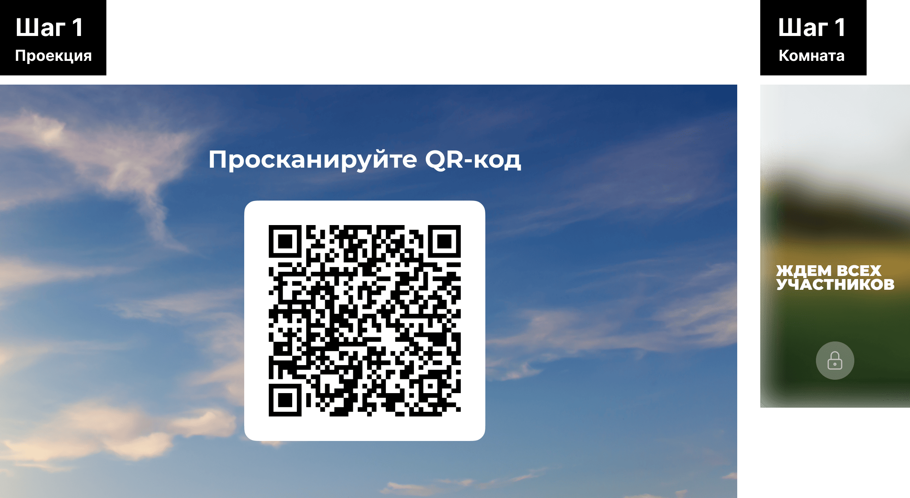
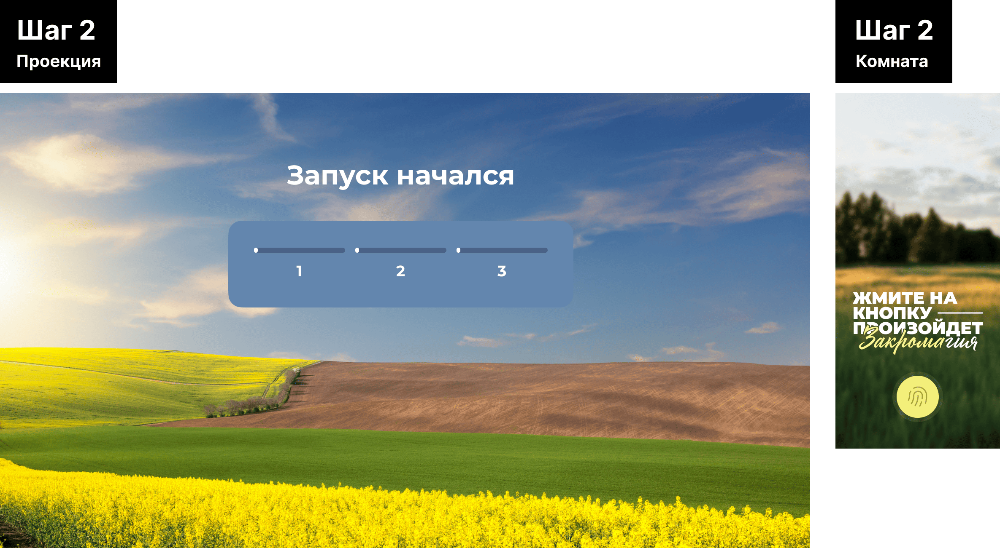
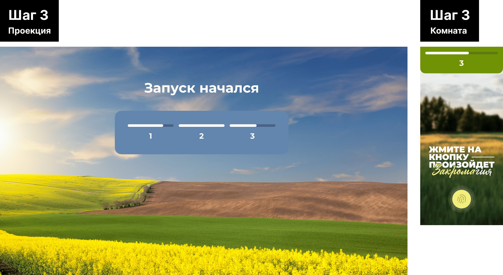
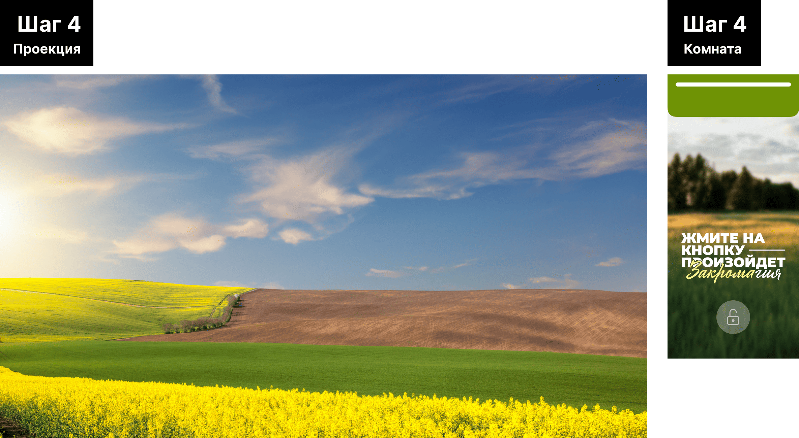
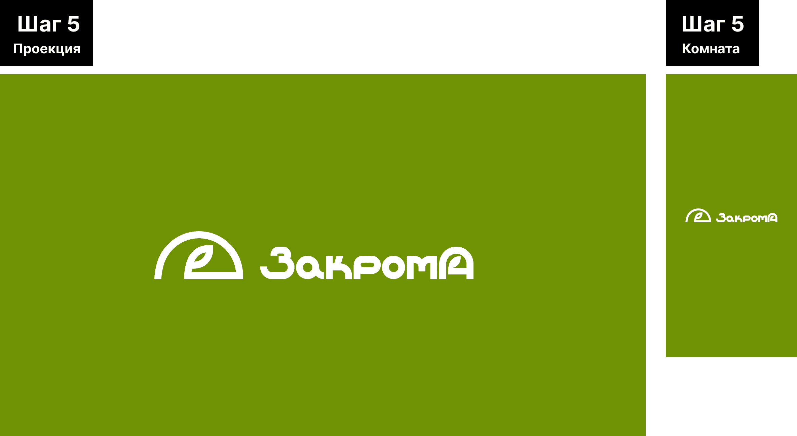

# zakroma-presentation

## Описание проекта

Для торжественного открытия обновленного сервиса "Закрома" была разработана публичная демонстрационная презентация, призванная подчеркнуть возможности и новый дизайн системы. Презентация предусматривала интерактивное участие трех пользователей, отображение прогресса их взаимодействия в реальном времени и финальную заставку с логотипом компании.
Сценарий включал этапы от подключения пользователей через QR-коды до синхронной демонстрации результатов на всех устройствах.

## Моя роль в проекте

- Спроектировал и реализовал логику работы презентации, используя Next.js и WebSocket для синхронного взаимодействия пользователей.
- Создал анимации и переходы, обеспечивающие визуальный акцент на каждом этапе сценария, включая появление и исчезновение элементов интерфейса.
- Настроил серверное и клиентское взаимодействие для синхронного обмена данными между устройствами.
- Реализовал систему индивидуального прогресса участников, отображающую действия пользователей в реальном времени.
- Обеспечил финальную интеграцию заставки и видео, которые синхронно запускаются после завершения задания.

## Технологии, используемые в проекте

   

## Код (Предпросмотр)

В данном разделе представлены отрывки кода, демонстрирующие ключевые моменты и методы, использованные в проекте. Эти фрагменты кода отражают стиль программирования, архитектурные решения и технологические практики, применённые в ходе работы.

> Хук для управления WebSocket-соединением, включая отправку и получение данных в реальном времени.

<details>
<summary><strong>useWebSocket.ts</strong> (Нажмите, чтобы раскрыть)</summary>

```
import { useEffect, useState, useCallback } from "react";

import { io, Socket } from "socket.io-client";

import { FlagsType } from "@/types/FlagsTypes";

const SOCKET_URL = process.env.NEXT_PUBLIC_SERVER;

type SocketType = Socket | null;

export function useSocket(room?: string) {
  const [socket, setSocket] = useState<SocketType>(null);
  const [activeUsers, setActiveUsers] = useState<
    { id: string; counter: number; index: number }[]
  >([]);
  const [flags, setFlags] = useState<FlagsType>({
    threeUsers: false,
    allTimersReached: false,
  });
  const [userId, setUserId] = useState<string | null>(null);
  const [roomFull, setRoomFull] = useState<boolean>(false);

  useEffect(() => {
    const socketInstance: Socket = io(SOCKET_URL);

    setSocket(socketInstance);

    socketInstance.on("connect", () => {
      if (socketInstance.id) {
        setUserId(socketInstance.id);
      }
    });

    if (room) {
      socketInstance.emit("joinRoom", room);
    }

    socketInstance.on("roomFull", () => {
      setRoomFull(true);
    });

    socketInstance.on("stateUpdate", ({ participants, flags }) => {
      setActiveUsers(participants);
      setFlags(flags);
    });

    return () => {
      socketInstance.disconnect();
      setSocket(null);
    };
  }, [room]);

  const updateCounter = useCallback(
    (counter: number) => {
      if (socket) {
        socket.emit("updateCounter", counter);
      }
    },
    [socket]
  );

  return { activeUsers, userId, flags, roomFull, updateCounter };
}

```

</details>

<br>

> Серверная логика для обработки событий WebSocket, управления подключениями и синхронизацией данных между клиентами.

<details>
<summary><strong>websocket-server.js</strong> (Нажмите, чтобы раскрыть)</summary>

```
require("dotenv").config();

const { createServer } = require("http");
const { Server } = require("socket.io");

const PORT = process.env.SERVER_PORT;

const httpServer = createServer();

const io = new Server(httpServer, {
  cors: {
    origin: process.env.NEXT_PUBLIC_BASE_URL,
  },
});

const MAX_PARTICIPANTS = 3;

// Комната участников и данные
const rooms = {
  participant: new Set(),
};
const userCounters = new Map();

io.on("connection", (socket) => {
  console.log(`User connected: ${socket.id}`);

  // Пользователь сообщает, что он в комнате
  socket.on("joinRoom", (room) => {
    if (room === "participant") {
      if (rooms.participant.size >= MAX_PARTICIPANTS) {
        // Отправляем сообщение, если лимит участников превышен
        socket.emit("roomFull", { message: "Сервис занят, попробуйте позже." });
        console.log(`User ${socket.id} rejected: room is full.`);
        return;
      }

      rooms.participant.add(socket.id);
      userCounters.set(socket.id, 0); // Инициализируем счетчик для пользователя
      broadcastState(); // Рассылаем текущее состояние
    }
  });

  // Обновление значения счетчика
  socket.on("updateCounter", (counter) => {
    if (userCounters.has(socket.id)) {
      userCounters.set(socket.id, counter); // Обновляем значение счетчика
      broadcastState(); // Рассылаем обновленное состояние
    }
  });

  // Когда пользователь отключается
  socket.on("disconnect", () => {
    rooms.participant.delete(socket.id);
    userCounters.delete(socket.id); // Удаляем данные пользователя
    console.log(`User disconnected: ${socket.id}`);
    broadcastState(); // Рассылаем обновленное состояние
  });
});

// Функция для отправки состояния всем клиентам
function broadcastState() {
  const participants = Array.from(rooms.participant).map((id, index) => ({
    id,
    counter: userCounters.get(id) || 0,
    index: index + 1,
  }));

  // Условия для флагов
  const threeUsersFlag = participants.length >= 3; // Флаг для 3+ пользователей
  const allTimersReachedFlag = participants.every((user) => user.counter === 5); // Флаг для счетчика 5

  io.emit("stateUpdate", {
    participants,
    flags: {
      threeUsers: threeUsersFlag,
      allTimersReached: allTimersReachedFlag,
    },
  });
}

httpServer.listen(PORT, () => {
  console.log(`WebSocket server is running on http://localhost:${PORT}`);
});

```

</details>

<br>

> Компонент для отображения уникального QR-кода, используемого для подключения участников.

<details>
<summary><strong>QrCode.tsx</strong> (Нажмите, чтобы раскрыть)</summary>

```
"use client";

import { useState, useEffect } from "react";
import { QRCodeCanvas } from "qrcode.react";
import styles from "./style.module.scss";

type QrCodeProps = {
  path: string;
};

export default function QrCode({ path }: QrCodeProps) {
  const baseUrl = process.env.NEXT_PUBLIC_BASE_URL;
  const qrUrl = `${baseUrl}${path}`;

  const [size, setSize] = useState(500);

  useEffect(() => {
    if (typeof window === "undefined") return;

    const mediaQuery = window.matchMedia("(min-width: 768px)");

    const updateSize = (event: MediaQueryListEvent | MediaQueryList) => {
      if (event.matches) {
        setSize(500);
      } else {
        setSize(256);
      }
    };

    updateSize(mediaQuery);

    mediaQuery.addEventListener("change", updateSize);

    return () => {
      mediaQuery.removeEventListener("change", updateSize);
    };
  }, []);

  return (
    <div className={styles.qrcode}>
      <QRCodeCanvas value={qrUrl} size={size} />
    </div>
  );
}

```

</details>

<br>

> Кнопка с таймером, управляющая задачами участников и отслеживающая их прогресс.

<details>
<summary><strong>TimerButton.tsx</strong> (Нажмите, чтобы раскрыть)</summary>

```
import Image from "next/image";
import classNames from "classnames";

import styles from "./style.module.scss";

type TimerButtonProps = {
  count: number;
  isPressed: boolean;
  startTimer: () => void;
  stopTimer: () => void;
  handleMouseDown: () => void;
  handleMouseUp: () => void;
};

const TimerButton = ({
  count,
  isPressed,
  startTimer,
  stopTimer,
  handleMouseDown,
  handleMouseUp,
}: TimerButtonProps) => {
  return (
    <button
      onMouseDown={(e) => {
        e.preventDefault();
        startTimer();
        handleMouseDown();
      }}
      onMouseUp={(e) => {
        e.preventDefault();
        stopTimer();
        handleMouseUp();
      }}
      onTouchStart={(e) => {
        e.preventDefault();
        startTimer();
        handleMouseDown();
      }}
      onTouchEnd={(e) => {
        e.preventDefault();
        stopTimer();
        handleMouseUp();
      }}
      onContextMenu={(e) => e.preventDefault()}
      className={classNames(styles.button, {
        [styles.disabled]: count === 5,
        [styles.pressed]: isPressed,
      })}
      disabled={count === 5}
    >
      {count === 5 ? (
        <Image
          src="/media/image/lock.svg"
          width={100}
          height={100}
          alt="lock"
          className={styles.lock}
        />
      ) : (
        <Image
          src="/media/image/fingerprint.svg"
          width={100}
          height={100}
          alt="fingerprint"
          className={styles.lock}
        />
      )}

      <div
        className={classNames(styles.pulse_circle, styles.pulse_circle_stabile)}
      ></div>
      <div className={styles.pulse_circle}></div>
      <div className={styles.pulse_circle}></div>
    </button>
  );
};

export default TimerButton;

```

</details>

<br>

> Счетчик для визуализации прогресса выполнения задания участниками в реальном времени.

<details>
<summary><strong>Counter.tsx</strong> (Нажмите, чтобы раскрыть)</summary>

```
import classNames from "classnames";
import styles from "./style.module.scss";

type CounterProps = {
  count: number;
  max: number;
  label?: number;
  variant: string;
};

const Counter = ({ count, max, variant, label }: CounterProps) => {
  const progressPercentage = Math.min((count / max) * 100, 100);

  return (
    <div className={classNames(styles.counter, styles[variant])}>
      <div className={styles.counter_progress}>
        <div
          className={styles.progress_bar}
          style={{ width: `${progressPercentage}%` }}
        ></div>
      </div>
      {label && <h2 className={styles.label}>{label}</h2>}
    </div>
  );
};

export default Counter;

```

</details>

## Принципы и инструменты разработки

- Код-стиль и форматирование: Prettier
- Система контроля версий: Gitlab
- Линтер: ESLint

## Команда

Общее количество человек: 2

Роли в команде:

- Frontend: 1
- Дизайнеры: 1

## Особые вызовы и преодоленные препятствия

- **Многопользовательская синхронность:** Настройка WebSocket для одновременного взаимодействия участников в реальном времени потребовала тщательного тестирования и отладки. Для меня это был первый опыт работы с WebSocket, и он включал в себя изучение технологии и её интеграцию в проект.
- **Реализация анимаций:** Вызовом стало обеспечение плавных переходов и визуальной логики при изменении состояния интерфейса, особенно при большом количестве одновременных действий.
- **Ограничение на три участника:** Система была адаптирована для работы строго с тремя подключенными пользователями, что потребовало особого подхода к обработке исключений и ошибок подключения.

## Галерея

Комната в ожидании трёх участников



Разблокировка комнаты



Интерактив: счётчики участников



Запуск видео



Завершение видео: заставка, редирект прелюдии и комнаты на сайт компании через 5 секунд



---

## Ссылки

Код проекта: Код находится под защитой соглашения о неразглашении NDA, из-за чего, к сожалению, не может быть предоставлен для общего доступа или просмотра.
